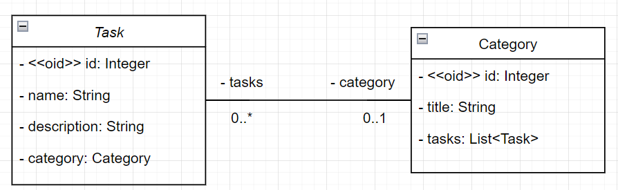

# Titulo

# Sobre o projeto

Lista de tarefas é um projeto desenvolvido para gerenciar tarefas, utilizando a API JPA e o padrão DAO.

# Funcionalidades

- Cadastro, Atualização, Exclusão e Listagem de tarefas.
- Agrupamento de tarefas por categoria.
- Cadastro, Atualização, Exclusão e Listagem de categorias.

# Tecnologias utilizadas

## Backend

- Java
- JPA
- MySQL

# Técnicas
- Padrão DAO (Data Access Object)

# Modelo Conceitual

# Autor

Isabel Henrique

https://www.linkedin.com/in/isabel-henrique/